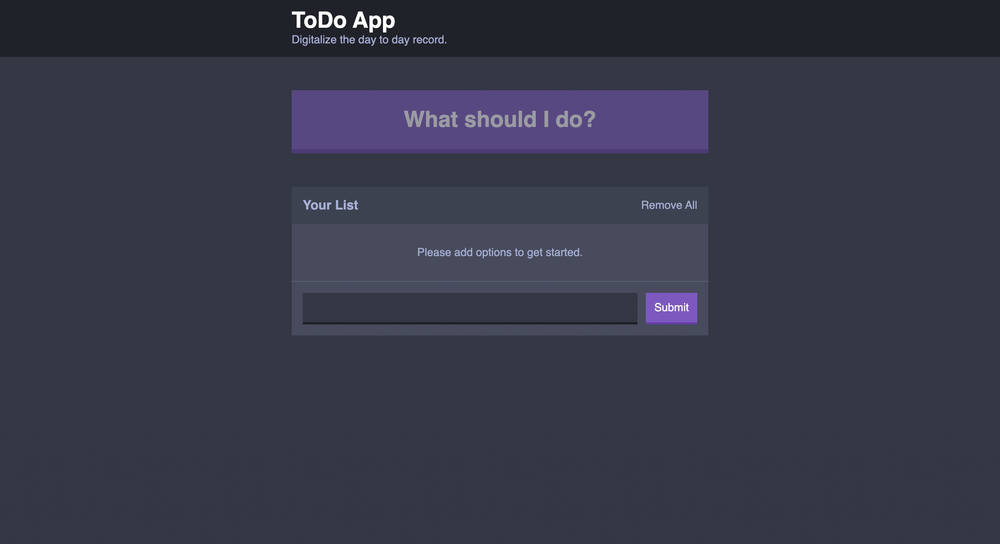

## A TODO App

- A simple todo app which enables to add and remove items.
- Local storage used for temperorary data storage.
  
## Snapshots
<p align="center"></p>

## Start the project on localhost without docker

1. Install npm packages:
    ```bash
    npm install
    ```
    
2. Build the app:
    ```bash
    npm run build:dev
    ```

3. Run the app
   ```bash
   npm run dev-server
   ```
4. Go to `localhost:8080` on web browser.

## Starting the project using docker
- Build and run the container
    ```bash
    docker-compose up --build
    ```
    
- Go to `localhost:8080` on web browser.